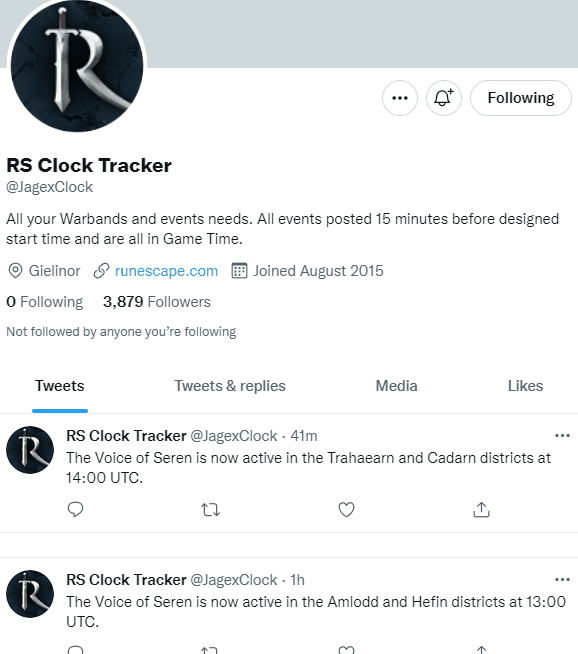

<h1 align="center"> Twitter - Telegram Bot </h1>
stat
<h1 align = "center">

</h1>

<h1 align = "center">
    
</h1>


# About


The project **Boss Hunt**, is an bot created for integrate the **Twitter API** with **Telegram API**.
In this case, the goal is to know when the boss will spawn in a specific city (Amlodd). 
For that, the bot will search tweets that contains those informations in the JagexClock profile (game profile),
then, the bot send to a specific chat in telegram the 10 last tweets about Amlodd.

# Technologies


- [Python](https://www.python.org/downloads/)
- [Twitter API](https://developer.twitter.com/en/docs)
- [Telebot](https://python-telegram-bot.readthedocs.io/en/v20.0a0/)


#Getting Started


To run this aplication, you will need the libraries:
- [requests](https://docs.python-requests.org/en/latest/)
- [dotenv](https://pypi.org/project/python-dotenv/)
- [telebot](https://python-telegram-bot.readthedocs.io/en/v20.0a0/)

###Requests
Many Python IDEs start with the requests library, but, to install the package, just run this command in your terminal:
```bash
$ pip install requests
```
###Dotenv
Dotenv is a library that helps when you need to put a password or key-values in the application. To install the package, run in your terminal:
```bash
$ pip install python-dotenv
```
Important: When you import the library, just use:
```
import dotenv
```
###Telebot
Telebot is a API developed by Telegram, that help devs create bots and integrate the bot with another API. To install the package, run in your terminal:
```bash
$ pip install python-telegram-bot
```
Important: When you impor the library, just use:
```
import telebot
```

#Usage


<p>You can use this bot in order to track and get any tweets by the username and a keyword, in order to filter the amount of information provided by the social media.</p>
For example, if you want to know the last 10 tweets about innovation in Tesla, just change the query in the url for "from: Tesla innovation".

#Contact


Daniel Alves Itame - daniel_itame@hotmail.com
Project Link: https://github.com/lakdodo/Twitter_Telegram_bot